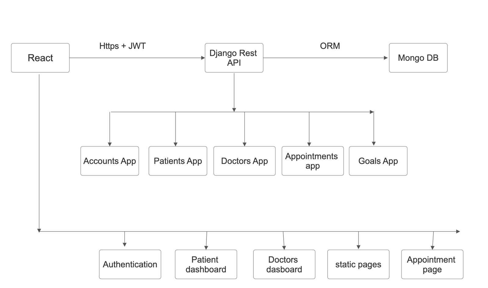

# Healthcare-Management-System-
A full-stack Healthcare Management System built with React, Django (DRF), and MongoDB. It enables efficient management of patients, doctors, appointments, and availability through secure REST APIs, offering a scalable and user-friendly digital healthcare solution. change 
# Team Members:
- Member 1: [Muzammil A Karimi] - Frontend Developer
- Member 2: [Saksham Wane] - Backend Developer
- Member 3: [Valikala Manohar] - Database Administrator
- Member 4: [Arpit Anand] - Full Stack Developer

# Features
- User Authentication: Secure login and registration for patients and doctors.
- Patient Management: CRUD operations for patient records.
- Doctor Management: CRUD operations for doctor profiles.
- Appointment Scheduling: Book, view, and manage appointments.
- Availability Management: Doctors can set and update their availability.

# Technologies Used
- Frontend: React
- Backend: Django Rest Framework (DRF)
- Database: MongoDB
- Authentication: JWT (JSON Web Tokens) for secure user authentication. 
- API: RESTful APIs for communication between frontend and backend.

# System Architecture
The system follows a client-server architecture where the React frontend communicates with the Django backend via RESTful APIs. The backend interacts with the MongoDB database to store and retrieve data. 

# Planning and Design
- task 01 : Registration and Login System with JWT Authentication for Patients and Doctors, and also design the database schema for patients and doctors with react webpages. 
- task 02 : dashboard for patients where he can view and update daily goals, book appointments, edit profile.
- task 03 : dashboard for doctors where he can view appointments, view patient details, set goals for patients.

- task 04 : Implement CRUD operations for managing patients and doctors in the backend using Django Rest Framework.
- task 05 : Implement appointment functionality, allowing patients to book, view, and manage appointments with doctors.

